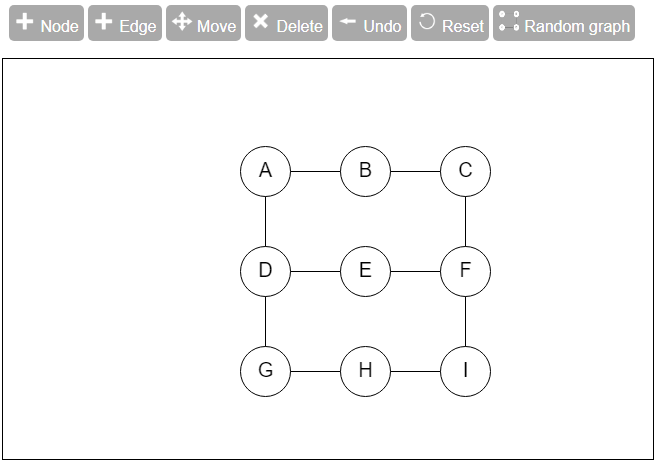
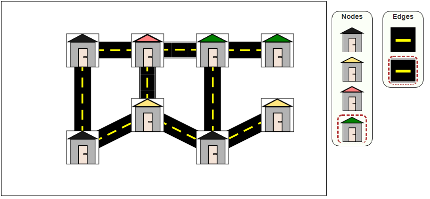

IN PROGRESS

# interactive-graph

Simple and customizable Angular components to display & manage graphs.



<b>interactive-graph</b> Let's you manage graphs (create and connect nodes to edges), interact with the graph (moving nodes around, deleting nodes/edges, highlighting nodes/edges etc), running graph algorithms on your own graph! The display of nodes and edges is customizable (see the second picture).

For a demo see [DEMO](https://tangkevkev.github.io/demoInteractiveGraph/). And the [CODE for the demo](https://github.com/tangkevkev/demoInteractiveGraph). 

This library was generated with [Angular CLI](https://github.com/angular/angular-cli) version 11.1.2.

## Install
```
$ npm install --save interactive-graph
```

## USAGE (BASIC)
```js
// in app.module.ts
import { InteractiveGraphModule} from 'interactive-graph';

@NgModule({
  ...
  imports: [
        InteractiveGraphModule
        ...
  ],
  ...
})
export class AppModule { }
```

```html
<!-- in app.component.html -->
<interactive-graph [showAlgorithmOption]=true 
  [showGraphtypeOption]=true (emitGraph)="setGraph($event)">
</interactive-graph>
```

```js
// in app.component.ts
import { InteractiveGraph } from 'interactive-graph'

graph: InteractiveGraph = null as any;

//From this graph instance you can access its topology (get access to nodes and edges)
setGraph(graph: InteractiveGraph){
    this.graph = graph;
    //this.graph.getNodes();
    //this.graph.getEdges();
 }
```

## USAGE (ADVANCED)


